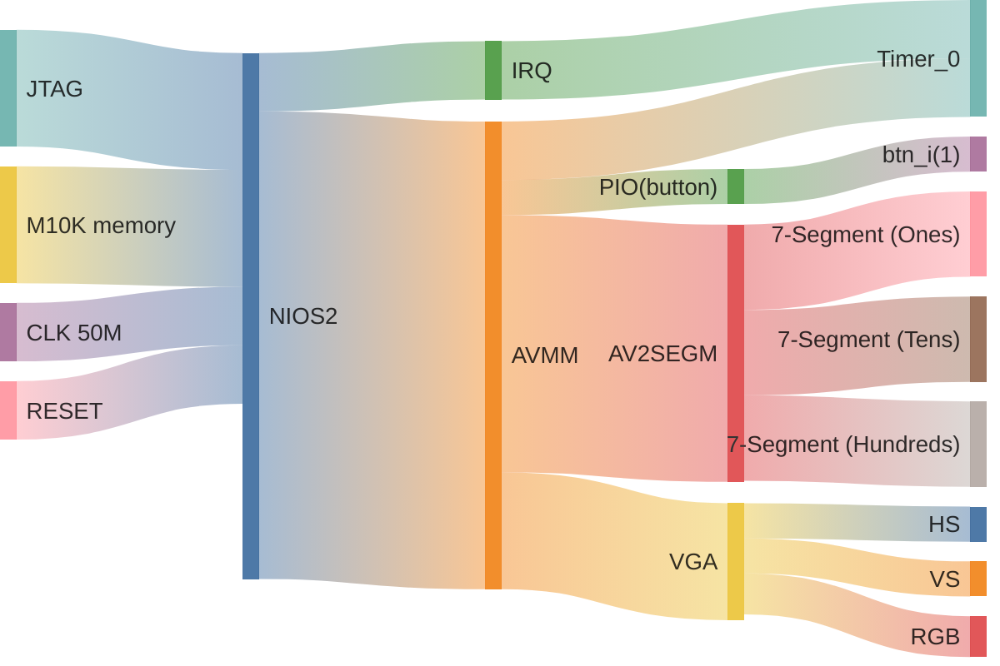
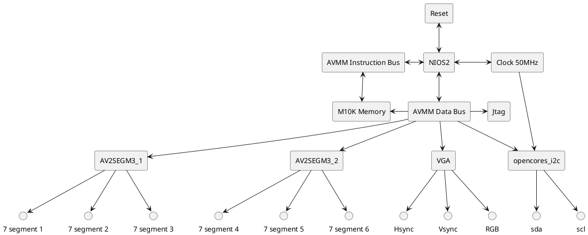

# ESN Project - I2C enabled Sopc + accelerometer + :computer: VGA :sparkle:

*note: for the best viewing experience, view this document in vscode with the [markdown preview enhanced by Yiyi Wang extension](https://marketplace.visualstudio.com/items?itemName=shd101wyy.markdown-preview-enhanced) installed, otherwise open the PDF version found [here](./readme.pdf)*

*you may need to set this setting in the extension's settings (done through the GUI):*
```yaml
plantuml server:
https://kroki.io/plantuml/svg/
```

to start cygwin from powershell:
```pwsh
& 'C:\intelFPGA\18.1\nios2eds\Nios II Command Shell.bat'
```

to generate bsp:

```bash
nios2-bsp hal ./software/bsp/ ./*.sopcinfo
```

to generate makefile:
```bash
nios2-app-generate-makefile --app-dir ./software/app --bsp-dir ./software/bsp --elf-name maion.elf --src-files ./sofware/app/main.c
```

both (one liner):
```bash
nios2-bsp hal ./software/bsp/ ./*.sopcinfo && nios2-app-generate-makefile --app-dir ./software/app --bsp-dir ./software/bsp --elf-name maion.elf --src-files ./sofware/app/main.c
```

## Introduction

This project aims to add an I2C interface using an open cores IP block over AVMM, in order to communicate with an accelerometer.

This version has an entire VGA driver built from scratch added to it do display the data in the form of a 2D crosshair on a screen (640x480 at 30 fps).

## System architecture

Similar to the other version of this project, with the added VGA hardware.





## Progress

The system is fully functionnal

## Conclusion
