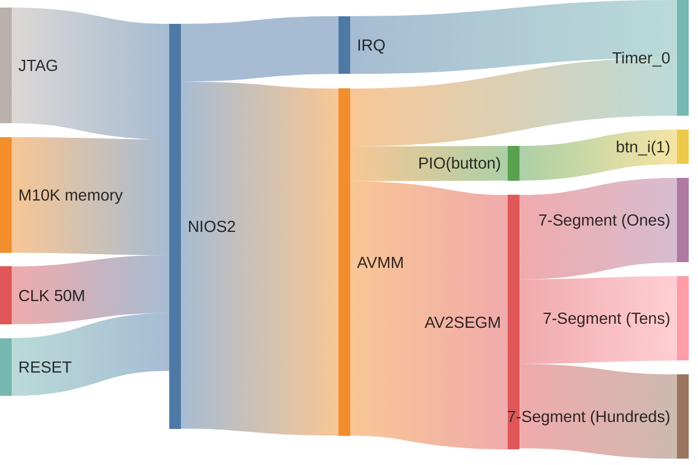
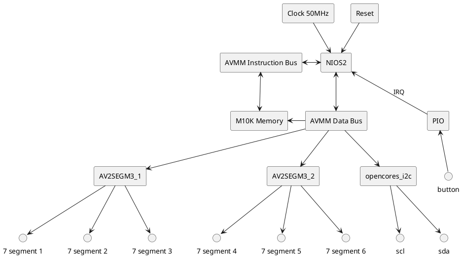

# ESN Project - I2C enabled Sopc + accelerometer

*note: for the best viewing experience, view this document in vscode with the [markdown preview enhanced by Yiyi Wang extension](https://marketplace.visualstudio.com/items?itemName=shd101wyy.markdown-preview-enhanced) installed, otherwise open the PDF version found [here](./readme.pdf)*

*you may need to set this setting in the extension's settings (done through the GUI):*
```yaml
plantuml server:
https://kroki.io/plantuml/svg/
```

to start cygwin from powershell:
```pwsh
& 'C:\intelFPGA\18.1\nios2eds\Nios II Command Shell.bat'
```

to generate bsp:

```bash
nios2-bsp hal ./software/bsp/ ./*.sopcinfo
```

to generate makefile:
```bash
nios2-app-generate-makefile --app-dir ./software/app --bsp-dir ./software/bsp --elf-name maion.elf --src-files ./sofware/app/main.c
```

both (one liner):
```bash
nios2-bsp hal ./software/bsp/ ./*.sopcinfo && nios2-app-generate-makefile --app-dir ./software/app --bsp-dir ./software/bsp --elf-name maion.elf --src-files ./sofware/app/main.c
```

## Introduction

This project aims to add an I2C interface using an open cores IP block over AVMM, in order to communicate with an accelerometer.

## System architecture

This will be quite similar to LAB2, with an added Timer connected to AVMM for setup and with an IRQ to report the tick.





## Progress

The system is fully functionnal

### 7 segments

The 3 digit 7 segment drivers from the previous labs have been modified to provide decimal dot displaying capabilities as well as a negative sign, using the character range above the number 9 (usually these ranges are reserved for the rest of the hex letters but these aren't used in this scenario.)
### I2C
The provided I2C core was implemented in the SOPc and a software driver package was created around it using the documentation provided by the developpers of the core. In this specific instance, we have 3 main functions that are used to interact with the I2C peripherals:

```c
bool I2C_AddressAuto(alt_u32 addr, alt_u32 reg_addr){...}
```
which provides addressing and error checking (first half of the I2C communication, used in both read and write which specifies the slave to write or read to, but also the specific register we want to read or write to). This function is used in both of the following functions:

```c
alt_u8 read8bit(alt_u32 addr, alt_u32 reg_addr){...}

void write8bit(alt_u32 addr, alt_u32 reg_addr, alt_u8 dat){...}
```
These two functions are mainly used for verifying and setting up the Accelerometer's registers prior to data acquisition.

There is an I2C scanner that's implemented to see if the IMU is detected or not, it works by checking the error return of the I2C start function on a range of addresses.

```c
void scanI2CDevices(void){
    ...
    for (address = 0x03; address <= 0x20; address++)
    {
        if(I2C_start(OPENCORES_I2C_0_BASE, address, 1) == 0)
            alt_printf("\r\nDevice found at address 0x%x\r\n", address);
        else
            alt_printf(" NODEV: %x ", address);
    }
    ...
}
```

The actual Accelerometer data acq is done in a different way to minimize overhead and latency:
```c
accel_dat readXYZ(){
    accel_dat d;
    alt_u32 dat[6] = {0,0,0,0,0,0};
    I2C_AddressAuto(IMU_ADDR, IMU_DAT_REG_START_ADDR);
    I2C_start(OPENCORES_I2C_0_BASE,IMU_ADDR,I2C_READ_OP);   // restart as READ

    //format (right justified): D1 4-0 + D0 7-0 -> 16g mode full res
    dat[0] =  I2C_read(OPENCORES_I2C_0_BASE,I2C_CONTINUE);
    dat[1] =  I2C_read(OPENCORES_I2C_0_BASE,I2C_CONTINUE);
    dat[2] =  I2C_read(OPENCORES_I2C_0_BASE,I2C_CONTINUE);
    dat[3] =  I2C_read(OPENCORES_I2C_0_BASE,I2C_CONTINUE);
    dat[4] =  I2C_read(OPENCORES_I2C_0_BASE,I2C_CONTINUE);
    dat[5] =  I2C_read(OPENCORES_I2C_0_BASE,I2C_STOP);

    d.x = (dat[1] << 8) | dat[0];
    d.y = ( dat[3] << 8) |  dat[2];
    d.z = ( dat[5] << 8) |  dat[4];

    return d;
}
```
Not finishing the I2C transaction allows us to read the 8 bit registers one after another without re-addressing, this is what the official datasheet advises to do to grab the values.

Before acquiring though some setup is done to properly set the chip's mode:
```c
void setup(){
    alt_printf("Doing IMU setup");
    write8bit(IMU_ADDR, IMU_POWER_CTL_REG_ADDR, 0b00001000); // measure mode ON
    write8bit(IMU_ADDR, IMU_DAT_FORMAT_REG_ADDR, 0b0001011); // right justified with sign, +- 16G range, full resolution mode ON
    write8bit(IMU_ADDR, IMU_FIFO_CTL_REG_ADDR, 0x00); //no fifo
    alt_printf("Done IMU setup");
}
```

### Calibration

Calibration is done by resting the board flat on a table, and then acquiring the raw values. Since the earth's gravity is 1G reglardless of accelerometer settings, we divide 1 by the acquired Z value to obtain a raw scaling factor. This scaling factor turns the raw data into G float values. Post-scaling, we acquire trimming values on XYZ so that the values equal 0,0,1 to remove some of the accelerometer bias.

This method is pretty basic, usually i'd do bias removal on all axis by using a jig that lets me orient the board precisely at 90° angles, but this is outside the scope of this lab. I could write the offsets into the Accelerometer chip itself instead of doing the calculations in the NIOS2 with its floating point acceleration hardware, but this way i'm not messing with the trim data of the accel that other might mess with (hence dead boards).

## HMI

There is one button that sends out an IRQ through a PIO to the NIOS2 core that cycles between the X Y Z values to display them on the 6 7 segments

## Conclusion

The system works as whole, it could be improved a bit more by adding better calibration of the IMU and some alternative ways of displaying the data (VGA?)