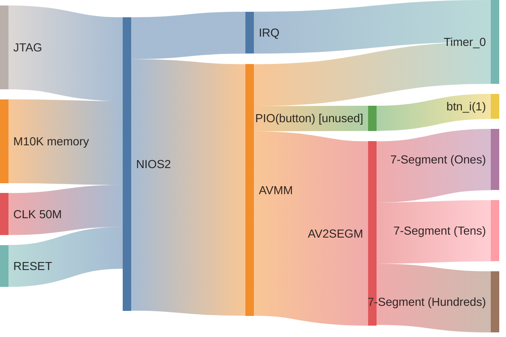
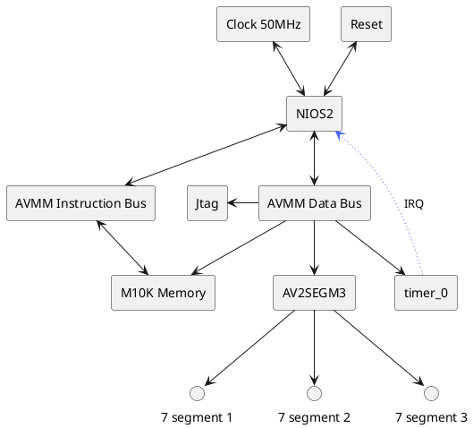

# ESN LAB 3 - 7 segment with avalon interface and IRQ Timer

*note: for the best viewing experience, view this document in vscode with the [markdown preview enhanced by Yiyi Wang extension](https://marketplace.visualstudio.com/items?itemName=shd101wyy.markdown-preview-enhanced) installed, otherwise open the PDF version found [here](./readme.pdf)*

*you may need to set this setting in the extension's settings (done through the GUI):*
```yaml
plantuml server:
https://kroki.io/plantuml/svg/
```

to start cygwin from powershell:
```pwsh
& 'C:\intelFPGA\18.1\nios2eds\Nios II Command Shell.bat'
```

to generate bsp:

```bash
nios2-bsp hal ./software/bsp/ ./*.sopcinfo
```

to generate makefile:
```bash
nios2-app-generate-makefile --app-dir ./software/app --bsp-dir ./software/bsp --elf-name maion.elf --src-files ./sofware/app/main.c
```

both (one liner):
```bash
nios2-bsp hal ./software/bsp/ ./*.sopcinfo && nios2-app-generate-makefile --app-dir ./software/app --bsp-dir ./software/bsp --elf-name maion.elf --src-files ./sofware/app/main.c
```

## Introduction

In this lab we have to add a timer IP to the SoPc so that the NISO2 cpu gets one IRQ per second to precisely count up.

## System architecture

This will be quite similar to LAB2, with an added Timer connected to AVMM for setup and with an IRQ to report the tick.





## Progress

The system is functionnal, the timer has been successfully added to the SOPc and does respond with it's IRQs, turns out configuration over AVMM wasn't even required because the timer was properly created as a bare-bones simplified timer with a 1 second period in QSYS.
## Conclusion

Timers are pretty easy to use, there was no major issue with this lab that would need to be highlighted.

The final Sopc code is as follows:

```c
volatile alt_u16 segmVal = 0;
volatile bool update_display = false;

int main() {
    alt_printf("init\r\n");
    alt_ic_irq_disable(TIMER_0_IRQ_INTERRUPT_CONTROLLER_ID, TIMER_0_IRQ);
    alt_ic_isr_register(TIMER_0_IRQ_INTERRUPT_CONTROLLER_ID, TIMER_0_IRQ, timer_isr, 0x00, 0x00);
    alt_ic_irq_enable(TIMER_0_IRQ_INTERRUPT_CONTROLLER_ID, TIMER_0_IRQ);

    alt_printf("Starting Timer Interrupt Demo\r\n");

    while (1) {
        if (update_display) {
            /** number to tens/zeros... logic here, see source file **/
        }
       usleep(10000);
    }

    return 0;
}
```

with the following ISR being called with the new ISR api:

```c
static void timer_isr(void *context) {
    alt_printf("trig\r\n");
    IOWR_ALTERA_AVALON_TIMER_STATUS(TIMER_0_BASE, 0);
    segmVal++;
    if (segmVal > 999) {
        segmVal = 0;
    }
    update_display = true;
}
```