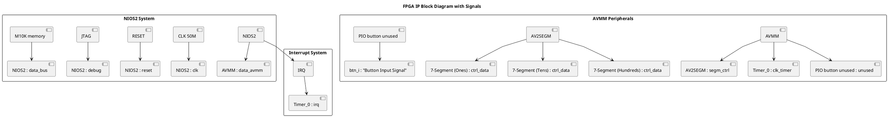

# ESN LAB 3 - 7 segment with avalon interface and IRQ Timer

to start cygwin from powershell:
```pwsh
& 'C:\intelFPGA\18.1\nios2eds\Nios II Command Shell.bat'
```

to generate bsp:

```bash
nios2-bsp hal ./software/bsp/ ./*.sopcinfo
```

to generate makefile:
```bash
nios2-app-generate-makefile --app-dir ./software/app --bsp-dir ./software/bsp --elf-name maion.elf --src-files ./sofware/app/main.c
```

both (one liner):
```bash
nios2-bsp hal ./software/bsp/ ./*.sopcinfo && nios2-app-generate-makefile --app-dir ./software/app --bsp-dir ./software/bsp --elf-name maion.elf --src-files ./sofware/app/main.c
```

## Introduction

In this lab we have to add a timer IP to the SoPc so that the NISO2 cpu gets one IRQ per second to precisely count up.

## System architecture



## Progress

The system is functionnal, both the 1 and 3 7 segment counters have been implmented, backed by C logic from the NIOS over the AVMM bus.

## Conclusion

The AVMM bus widths need to be managed with care as using an 8 bit bus width will cause the default 32 bit IOWR/RD functions from the NIOS2 HAL to fail, to fix this using the 8 bit variants of these functions is require, as follows:

```c
IOWR_8DIRECT(AV2SEGM3_0_BASE, 0x0, ones);
alt_printf("ones: %x\r\n", ones);
IOWR_8DIRECT(AV2SEGM3_0_BASE, 0x1, tens);
alt_printf("tens: %x\r\n", tens);
IOWR_8DIRECT(AV2SEGM3_0_BASE, 0x2, hundreds);
alt_printf("hundreds: %x\r\n", hundreds);
```

The actual AV2SEGM3 ip (the one with 3 7 segments) has been implemented using an address mode set of AVMM registers, where each register corresponds to one 7 segment.